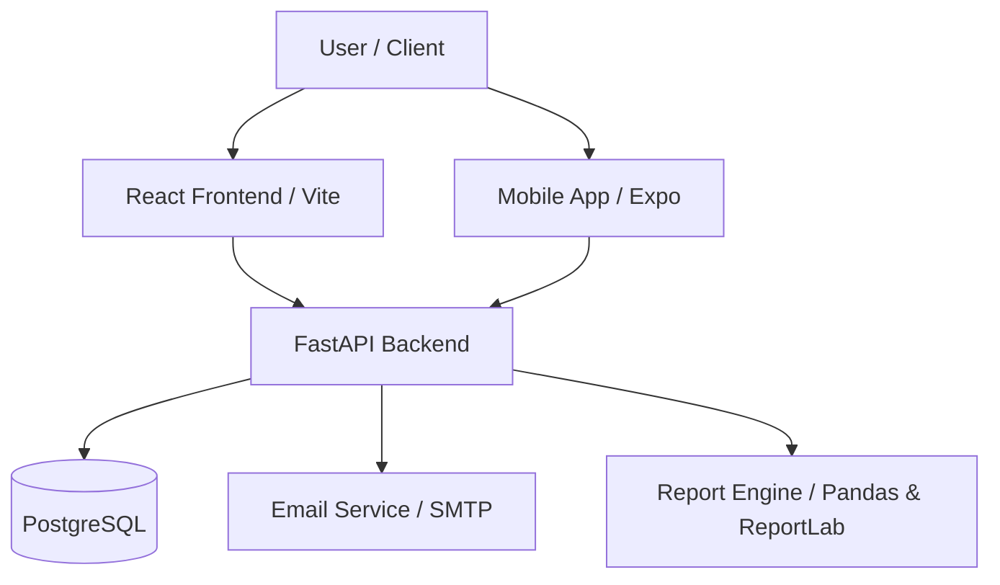

# 🚍 FRAS: Fleet Reporting & Analytics System

[](https://fastapi.tiangolo.com/)
[](https://reactjs.org/)
[](https://www.postgresql.org/)
[](https://vitejs.dev/)

A high-performance, full-stack ecosystem for fleet data management, real-time analytics, and automated reporting. **FRAS** simplifies complex logistics data into actionable insights through its modern web dashboard and mobile interface.

---

## 🏗️ System Architecture



---

## ✨ Key Features

-   **🔐 Enterprise Security**: JWT-based authentication with Role-Based Access Control (RBAC). 
-   **📊 Real-time Dashboard**: Interactive KPIs and data visualization for fleet performance.
-   **📑 Smart Reporting**: Automated Excel and PDF report generation (fully customizable).
-   **📤 Bulk Data Inflow**: Drag-and-drop CSV/Excel imports with automated data cleaning and validation.
-   **📩 Automated Alerts**: Direct-to-email report delivery.
-   **🚨 Anomaly Detection**: Built-in statistical analysis to identify devious data patterns.
-   **📱 Cross-Platform**: Native mobile experience alongside a responsive web interface.

---

## 🛠️ Technology Stack

| Layer | Technologies |
| :--- | :--- |
| **Backend** | Python 3.10+, FastAPI, SQLAlchemy, PostgreSQL, Pandas, openpyxl |
| **Frontend** | React 18, Vite, Material-UI (MUI), Chart.js |
| **Mobile** | React Native, Expo |
| **Integrations** | FastAPI-Mail (SMTP), JWT (Auth), B-Crypt |

---

## 🚀 Quick Start

### 1. Clone the Repository
```bash
git clone https://github.com/Abiola26/FRAS.git
cd FRAS
```

### 2. Backend Setup
```powershell
cd backend
python -m venv venv
.\venv\Scripts\Activate
pip install -r requirements.txt
# Configure your .env file (based on .env.example)
python create_tables.py
python create_admin.py
python start.py
```

### 3. Frontend Setup
```powershell
cd ../frontend
npm install
npm run dev
```

### 4. Mobile Setup
```powershell
cd ../mobile
npm install
npx expo start
```

---

## 📄 Recent Updates (v1.1.0)
- **Reporting Overhaul**: Reports are now streamlined to focus on **Bus Performance** and **Daily Subtotals**, ensuring concise and professional exports.
- **Improved Performance**: Optimized database queries for the analytics dashboard.
- **Enhanced Security**: Refactored JWT handling and environment variable management.

---

## 🤝 Support

For support or feature requests, please contact the development team or open a GitHub issue.

---

**© 2026 Fleet Reporting & Analytics System. Proprietary. All rights reserved.**
